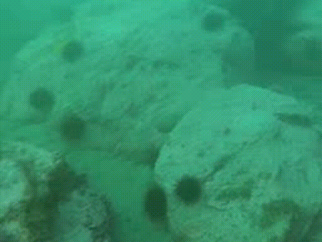

# WWE-UIE (WACV 2026) [[paper]]()

This is a PyTorch implementation for "WWE-UIE: A Wavelet & White Balance Efficient Network for Underwater Image Enhancement." This document summarizes the environment requirements, dataset layout, and common commands you need to run the project.

### Full-reference (with ground truth at bottom-right annotated)
|   |   |
### None reference
|  |  |


## Requirements

- Python 3.10 (recommended)
- PyTorch 2.4.0 + CUDA 11.8 (recommended)
- Additional packages listed in `requirements.txt`

```bash
pip install -r requirements.txt
```

## Repository Layout

```
WWE-UIE/
├── model.py                 # Wavelet-based backbone
├── train.py                 # paired training entry point
├── test.py                  # paired evaluation (PSNR/SSIM)
├── test_nr.py               # non-reference evaluation (NIQE/UCIQE/URanker)
└── utils/
    ├── dataset.py           # paired & non-ref dataloaders
    ├── loss_funcs.py        # perceptual / SSIM / edge-aware loss
    ├── metrics.py           # PSNR, SSIM, NIQE, UCIQE, URanker
    ├── utils.py             # plotting & visualization helpers
    └── ...                  # CIDNet & URanker configs / weights
```

## Dataset Preparation

All dataset paths default to `UnderWaterDataset/`. Feel free to relocate them, but keep the directory layout identical. Paired datasets require matching filenames under `input/` and `GT/`. Non-reference datasets only need raw images.

### Paired Datasets (train / val / test)

```
UnderWaterDataset/
├── EUVP-Dark/
│   ├── train/
│   │   ├── input/xxx.png
│   │   └── GT/xxx.png
│   ├── val/
│   │   ├── input/xxx.png
│   │   └── GT/xxx.png
│   └── test/
│       ├── input/xxx.png
│       └── GT/xxx.png
├── EUVP-Scene/...
├── LSUI/...
├── UFO-120/...
└── UIEB/...
```

Add your own dataset by creating `train/<name>/input`, `train/<name>/GT`, and matching folders under `val/` and `test/`. Update `train.py` (dataset switch) or override the CLI arguments to point at the new folders.

### Non-reference Datasets (NIQE / UCIQE / URanker)

```
UnderWaterDataset/
├── Challenging-60/test/
│   └── *.png
├── EUVP/test/
│   └── *.png
├── U45/test/
│   └── *.png
└── UCCS/test/
    ├── blue/*.png
    ├── blue-green/*.png
    └── green/*.png
```

## Training

```bash
python train.py \
  --dataset [dataset] \
  --epoch 100 \
  --train_batch_size 24 \
  --model_name WWE-UIE
```

Checkpoints, logs, and predictions are written to `./output/<model_name>/<dataset>/<timestamp>/`:

- `best_model.pth`: weights from the best PSNR checkpoint
- `records.txt`: validation PSNR/SSIM per epoch

## Evaluation (paired datasets)

```bash
python test.py \
  --dataset [dataset] \
  --ckpt [checkpoint.pth] \
```

## Evaluation (non-reference metrics)

```bash
python test_nr.py \
  --dataset [dataset] \
  --ckpt [checkpoint.pth] \
```
